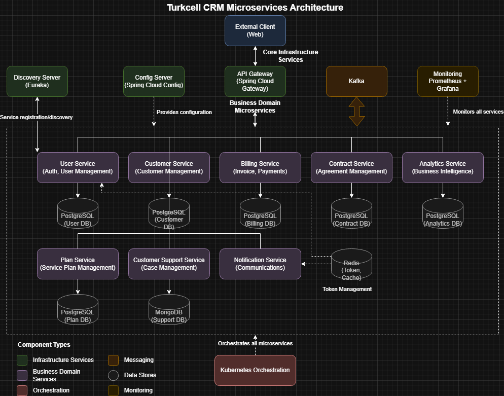

# CRM Microservices System

A comprehensive Customer Relationship Management (CRM) platform built with a microservices architecture using Spring Boot and Spring Cloud technologies.

## Table of Contents

- [Overview](#overview)
- [Architecture](#architecture)
- [Microservices](#microservices)
- [Tech Stack](#tech-stack)
- [Getting Started](#getting-started)
- [Deployment](#deployment)
- [API Documentation](#api-documentation)
- [Monitoring](#monitoring)
- [Contributing](#contributing)
- [License](#license)

## Overview

This project implements a scalable and resilient CRM system for managing customer relationships, billing, contracts, service plans, and analytics. The system is designed with a microservices architecture to provide high availability, fault tolerance, and independent scalability of components.

## Architecture

The system follows a modern microservices architecture pattern with service discovery, API gateway, configuration management, and monitoring.

<!-- Architecture Diagram -->
<div align="center">
  <h3>System Architecture</h3>
  
</div>

## Microservices

The application consists of the following microservices:

| Microservice             | Description                                        |
| ------------------------ | -------------------------------------------------- |
| User Service             | Authentication, authorization, and user management |
| Customer Service         | Customer profile and information management        |
| Billing Service          | Invoice generation, payment processing             |
| Contract Service         | Contract creation, management, and tracking        |
| Plan Service             | Service plans and offering management              |
| Customer Support Service | Support ticket management and resolution           |
| Analytics Service        | Business insights and reporting                    |
| Notification Service     | Customer and internal communications               |

### Infrastructure Services

| Service            | Description                                 |
| ------------------ | ------------------------------------------- |
| Config Server      | Centralized configuration management        |
| Discovery Server   | Service registration and discovery (Eureka) |
| Gateway Server     | API gateway for routing and load balancing  |
| Kafka              | Message broker for async communication      |
| Prometheus/Grafana | Monitoring and metrics visualization        |

## Tech Stack

- **Backend**: Spring Boot, Spring Cloud, Spring Security, Spring Data JPA
- **Security**: JWT for authentication and authorization
- **Database**: PostgreSQL (primary), Redis (caching)
- **Messaging**: Apache Kafka
- **Documentation**: OpenAPI/Swagger
- **Monitoring**: Prometheus, Grafana, Spring Actuator
- **CI/CD**: GitHub Actions
- **Containerization**: Docker, Kubernetes
- **Resilience**: Spring Cloud Circuit Breaker, Resilience4j

## Getting Started

### Prerequisites

- JDK 17+
- Docker and Docker Compose
- Maven 3.6+

### Local Development

1. Clone the repository:

   ```bash
   git clone https://github.com/your-username/crm-microservices-turkcell-final-project.git
   cd crm-microservices-turkcell-final-project
   ```

2. Start the infrastructure services using Docker Compose:

   ```bash
   docker-compose -f docker-compose.dev.yml up -d
   ```

3. Run individual services:
   ```bash
   cd <service-directory>
   mvn spring-boot:run
   ```

## Deployment

### Docker Deployment

```bash
docker-compose up -d
```

### Kubernetes Deployment

The `k8s` directory contains all necessary Kubernetes manifests for deploying the entire system.

```bash
kubectl apply -f k8s/00-namespace.yaml
kubectl apply -f k8s/01-configmaps.yaml
kubectl apply -f k8s/02-storage.yaml
kubectl apply -f k8s/03-databases.yaml
kubectl apply -f k8s/04-kafka.yaml
kubectl apply -f k8s/05-monitoring.yaml
kubectl apply -f k8s/07-config-maps.yaml
kubectl apply -f k8s/06-core-services.yaml
kubectl apply -f k8s/08-microservices.yaml
```

## API Documentation

API documentation is available via Swagger UI at the following endpoints:

### Via Direct Service Access

- User Service: `http://localhost:8010/swagger-ui.html`
- Customer Service: `http://localhost:8020/swagger-ui.html`
- Billing Service: `http://localhost:8030/swagger-ui.html`
- Contract Service: `http://localhost:8040/swagger-ui.html`
- Plan Service: `http://localhost:8050/swagger-ui.html`
- Customer Support Service: `http://localhost:8060/swagger-ui.html`
- Analytics Service: `http://localhost:8070/swagger-ui.html`
- Notification Service: `http://localhost:8090/swagger-ui.html`

### Via API Gateway

- User Service: `http://localhost:8080/user-service/swagger-ui.html`
- Customer Service: `http://localhost:8080/customer-service/swagger-ui.html`
- Billing Service: `http://localhost:8080/billing-service/swagger-ui.html`
- Contract Service: `http://localhost:8080/contract-service/swagger-ui.html`
- Plan Service: `http://localhost:8080/plan-service/swagger-ui.html`
- Customer Support Service: `http://localhost:8080/customer-support-service/swagger-ui.html`
- Analytics Service: `http://localhost:8080/analytics-service/swagger-ui.html`
- Notification Service: `http://localhost:8080/notification-service/swagger-ui.html`

### API Endpoints Overview

#### User Service API

- **POST /api/v1/auth/register**: Register new user
- **POST /api/v1/auth/login**: Authenticate user
- **GET /api/v1/users**: List all users (admin only)
- **GET /api/v1/users/{id}**: Get user by ID
- **PUT /api/v1/users/{id}**: Update user information
- **DELETE /api/v1/users/{id}**: Delete user (admin only)

#### Customer Service API

- **POST /api/v1/customers**: Create new customer
- **GET /api/v1/customers**: List all customers
- **GET /api/v1/customers/{id}**: Get customer by ID
- **PUT /api/v1/customers/{id}**: Update customer information
- **DELETE /api/v1/customers/{id}**: Delete customer
- **GET /api/v1/customers/search**: Search customers by criteria

#### Billing Service API

- **POST /api/v1/invoices**: Create new invoice
- **GET /api/v1/invoices**: List all invoices
- **GET /api/v1/invoices/{id}**: Get invoice by ID
- **PUT /api/v1/invoices/{id}/status**: Update invoice status
- **POST /api/v1/payments**: Process payment
- **GET /api/v1/payments/customer/{customerId}**: Get customer payment history

#### Contract Service API

- **POST /api/v1/contracts**: Create new contract
- **GET /api/v1/contracts**: List all contracts
- **GET /api/v1/contracts/{id}**: Get contract by ID
- **PUT /api/v1/contracts/{id}**: Update contract details
- **DELETE /api/v1/contracts/{id}**: Terminate contract
- **GET /api/v1/contracts/customer/{customerId}**: Get customer contracts

#### Plan Service API

- **POST /api/v1/plans**: Create new service plan
- **GET /api/v1/plans**: List all service plans
- **GET /api/v1/plans/{id}**: Get plan by ID
- **PUT /api/v1/plans/{id}**: Update plan details
- **DELETE /api/v1/plans/{id}**: Delete plan
- **GET /api/v1/plans/category/{category}**: Get plans by category

#### Customer Support Service API

- **POST /api/v1/tickets**: Create support ticket
- **GET /api/v1/tickets**: List all tickets
- **GET /api/v1/tickets/{id}**: Get ticket by ID
- **PUT /api/v1/tickets/{id}/status**: Update ticket status
- **POST /api/v1/tickets/{id}/comments**: Add comment to ticket
- **GET /api/v1/tickets/customer/{customerId}**: Get customer tickets

#### Analytics Service API

- **GET /api/v1/analytics/revenue**: Get revenue analytics
- **GET /api/v1/analytics/customers**: Get customer analytics
- **GET /api/v1/analytics/contracts**: Get contract analytics
- **GET /api/v1/analytics/support**: Get support ticket analytics
- **GET /api/v1/analytics/dashboard**: Get consolidated dashboard data

#### Notification Service API

- **POST /api/v1/notifications**: Send notification
- **GET /api/v1/notifications**: List all notifications
- **GET /api/v1/notifications/{id}**: Get notification by ID
- **GET /api/v1/notifications/user/{userId}**: Get user notifications
- **PUT /api/v1/notifications/{id}/read**: Mark notification as read

## Monitoring

The system includes comprehensive monitoring using:

- **Prometheus**: Collects metrics from all services (`http://localhost:9090`)
- **Grafana**: Visualizes metrics through custom dashboards (`http://localhost:3000`)
- **Spring Actuator**: Provides health and metrics endpoints for each service (`/actuator`)

## Contributing

1. Fork the repository
2. Create your feature branch (`git checkout -b feature/amazing-feature`)
3. Commit your changes (`git commit -m 'Add some amazing feature'`)
4. Push to the branch (`git push origin feature/amazing-feature`)
5. Open a Pull Request

## License

This project is licensed under the MIT License - see the LICENSE file for details.
